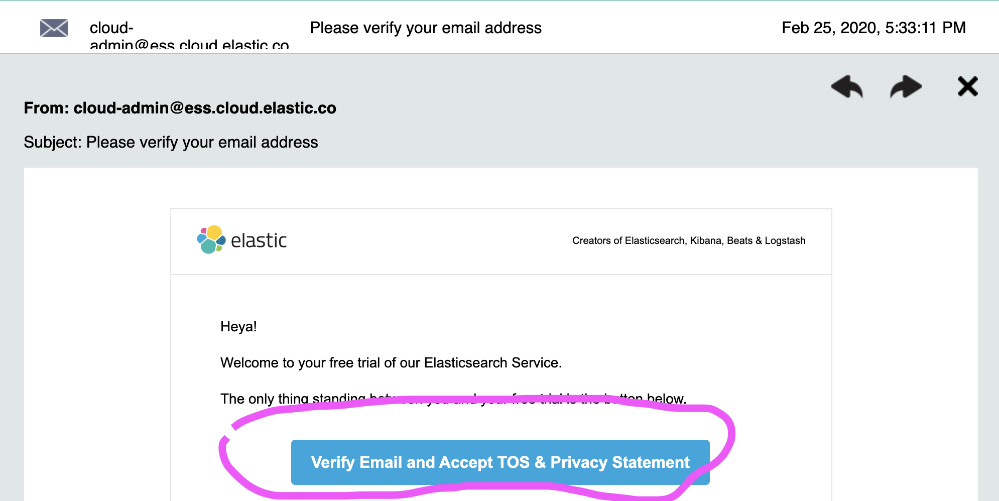
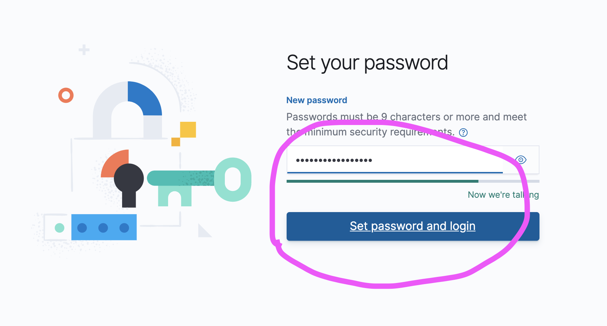
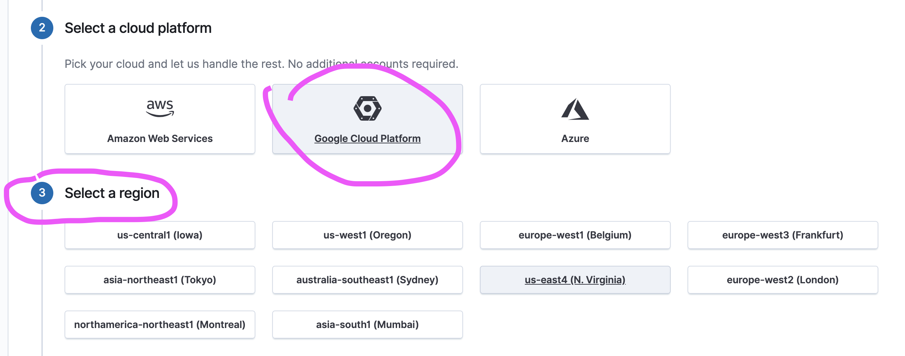
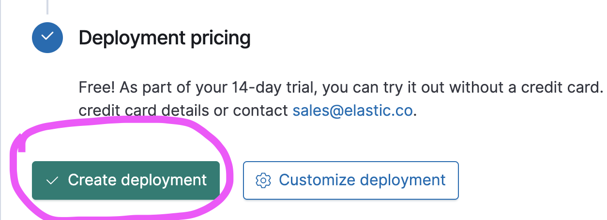

# Create an Account

If you already have an Elastic Cloud account, [head on over and sign in](https://cloud.elastic.co).

If you've never used Elastic Cloud before, you'll need to make an account. Head over to
[Elastic Cloud](http://elastic.co/cloud/elasticsearch-service/signup) and sign up.

1. Enter your email to start your trial.

1. In a few seconds you should receive a confirmation message, click the blue button.

1. Choose a password. You may want to write this down in case you're logged out for inactivity during
a break.

1. You're now signed into the "command and control" center, and you can create your trial deployment.

Name the deployment:

Choose your favorite cloud provider and region. This is where your deployment will be hosted by
Elastic for 14 days.

Choose your software version (this workshop is designed for use with 7.6).

If you're working fast, feel free to click on `Customize deployment`. In a  non-trial scenario,
this is where you would go to choose the size of your Elasticsearch, Kibana, App Search, and
APM resources.

Otherwise, just click `Create deployment`!

